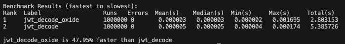

===========================================================
PyFxA-Oxide: A fork of `PyFxA <https://github.com/mozilla/PyFxA>`_ with `jwtoxide` support
===========================================================

PyFxA-Oxide is a fork of the PyFxA library that instead utilizes `jwtoxide` for optimized JWT decoding.

Performance Comparison
======================
